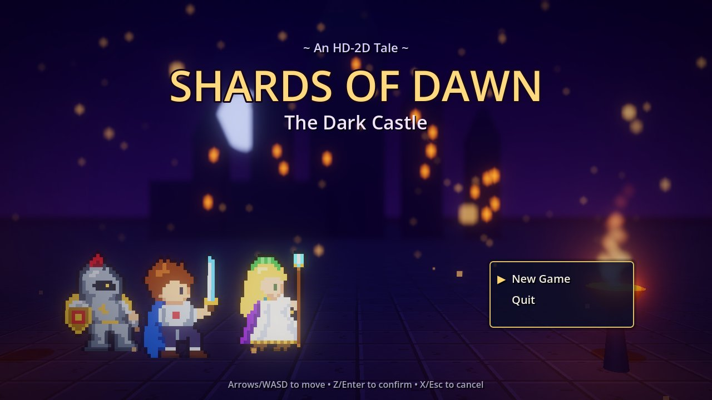
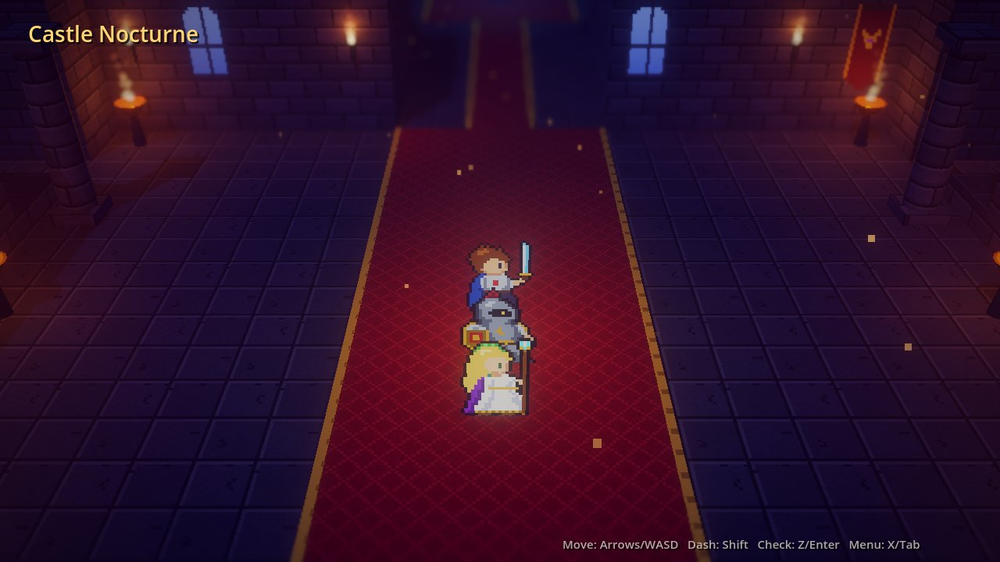
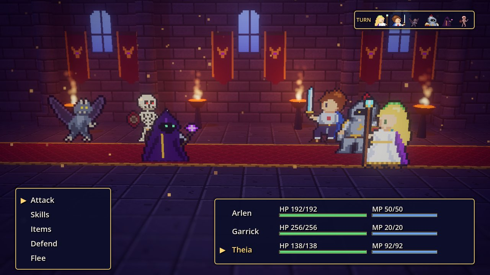
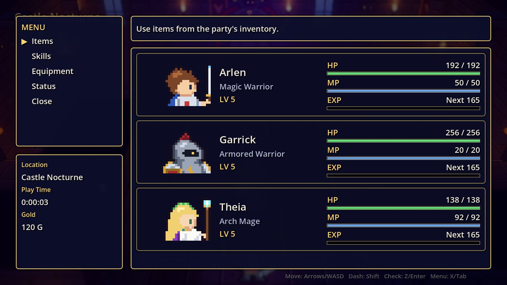
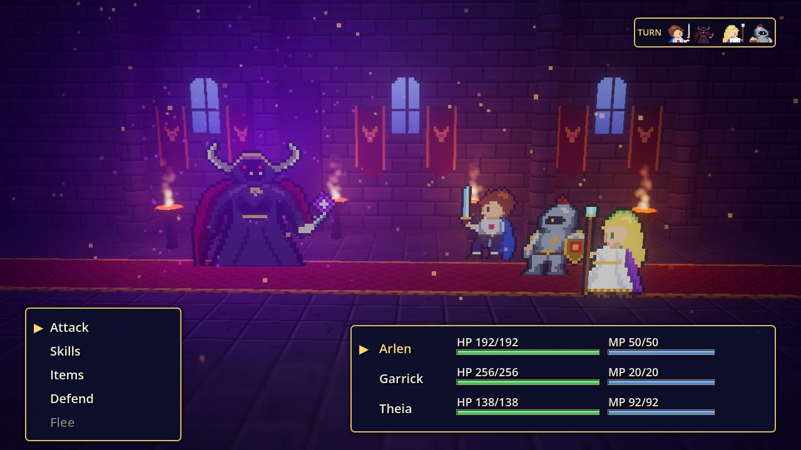
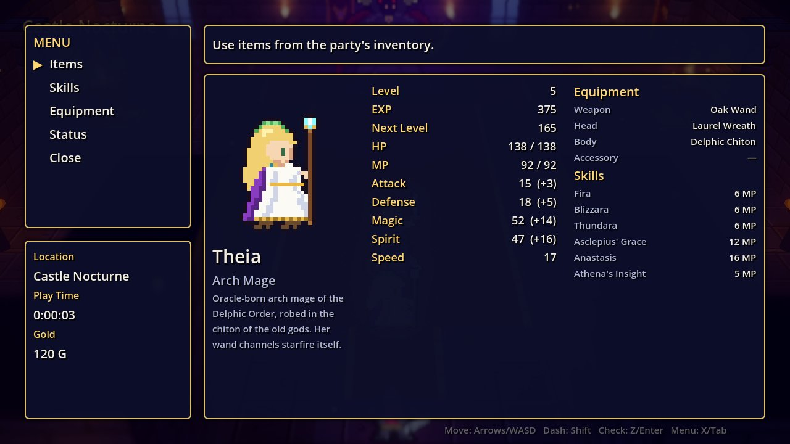
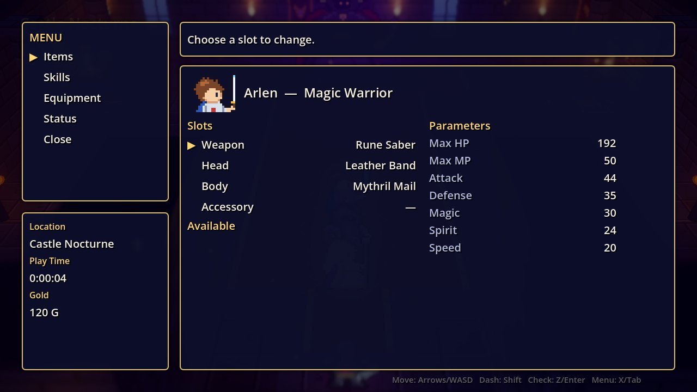

# Shards of Dawn: The Dark Castle

An HD-2D style JRPG for **Godot 4.7**: pixel-art billboard characters in a lit,
fogged and depth-of-field-blurred 3D castle. Three heroes storm Castle Nocturne
to defeat the Dark Lord Malzeth.



| Exploration | Battle |
|---|---|
|  |  |
|  |  |
|  |  |

## The party

| | Hero | Class | Role |
|---|---|---|---|
| ⚔️ | **Arlen** | Magic Warrior (protagonist) | Elemental sword skills (Flame Blade, Thunder Slash, Lumina Blade) plus Cure |
| 🛡️ | **Garrick** | Armored Warrior (sidekick) | Tank: Provoke, Shield Bash, Iron Wall, War Cry, Earthsplitter |
| 🔮 | **Theia** | Arch Mage (wand, Greek chiton & laurel wreath) | Fira / Blizzara / Thundara, Asclepius' Grace, Anastasis, Meteor, Holy |

## Running

Open the folder in Godot 4.7 (Forward+ renderer) and press **F5**, or run
`godot --path .` from this directory. The main scene is `scenes/main.tscn`.

### Controls

All actions are defined in **Project Settings → Input Map**.

| Action | Keyboard | Gamepad |
|---|---|---|
| `move_*` / `ui_*` | Arrows or WASD | D-pad / left stick |
| `interact` / `ui_accept` | Z, E, Enter, Space | A |
| `menu` / `ui_cancel` | X, Tab, M, Esc (cancel: X, Esc, Backspace) | Y / B |
| `dash` | Shift | Right shoulder |

The mouse also works in menus (click to choose, right-click to go back).

## Gameplay

- **Explore** Castle Nocturne: the entrance hall, the west and east wings, the
  great hall and the throne room.
- **Six treasure chests** hold better weapons, armor, accessories and items.
- **Enemies roam visibly** on the map (no random encounters); touch one to fight.
  They chase you when you get close.
- The **save crystal** in the great hall fully restores the party and records a
  checkpoint. If the party falls you can retry from the last crystal.
- **Turn-based battles**: Attack, Skills, Items, Defend, Flee. Turn order is by
  Speed (shown top-right). Elemental weaknesses deal 1.5x damage; buffs,
  debuffs, taunts, criticals and revives are all supported.
- **Party menu**: Items, Skills (field healing), Equipment (with stat
  comparison) and a detailed Status page per hero.
- **The Dark Lord** has two phases: at half HP he transforms, acts twice per
  round and charges the devastating *Abyssal Ruin* (watch for the warning and
  Defend!).

## Project structure

It's a conventional Godot project: content is authored as scenes and resources
and edited in the inspector, and scripts hold behaviour.

```
project.godot              Input map, autoloads, global theme, audio buses, physics layer names
default_bus_layout.tres    Master / Music / SFX buses

assets/
  sprites/heroes|enemies/  PNG sprite sheets (idle, walk, attack, cast, hurt, KO frames)
  sprites/portraits/       Dialogue and menu portraits
  textures/                Pixel-art tiles and effect textures
  audio/sfx/*.wav          Sound effects
  audio/music/*.ogg        Looping music tracks

data/                      Game data as Resources (.tres), edited in the inspector
  heroes/                  HeroData: stats, growth, learnset, sprite frames, portrait
  skills/                  SkillData: cost, kind, element, power, target, buffs/debuffs
  items/, equipment/       ItemData, EquipmentData (stat bonuses, who can equip)
  enemies/                 EnemyData: stats, rewards, weaknesses, weighted AI actions
  new_game.tres            GameStartData: starting party, level, gold, items and gear

resources/
  sprite_frames/           SpriteFrames for every character
  materials/               Shared StandardMaterial3D resources
  environments/            Environment + CameraAttributes (tilt-shift DOF, glow, fog) per scene
  tiles/castle_tiles.tres  MeshLibrary (floor, wall, ledge, carpet tiles with collision)
  ui/main_theme.tres       Global Theme with type variations (CardPanel, GoldLabel, …)

shaders/                   Screen fade/wipe and vignette

scenes/
  main.tscn                Flow controller; screens are PackedScene exports
  autoload/                ui_layer.tscn (UI), audio_manager.tscn (Audio)
  field/castle.tscn        GridMap level, props, chests, enemies, crystal, throne, party, camera, HUD
  field/                   player (CharacterBody3D), follower, field_enemy, chest, save_crystal, throne
  battle/battle.tscn       Arena, camera, hero/enemy slot markers, battle UI
  fx/                      GPUParticles3D / AnimationPlayer effects (burst, flames, bolt, holy pillar, …)
  props/                   pillar, brazier, wall torch, fire, banner, window, dust, castle silhouette
  ui/                      party menu, party card, dialogue box, select list row
  screens/                 title, ending, game over
  common/character_sprite.tscn  AnimatedSprite3D billboard + blob shadow

scripts/                   Behaviour for the scenes above, plus resources/ (the data classes)
tests/                     Headless checks (see below)
```

### Editing content

- **Stats, skills, items, gear, enemies:** open the `.tres` files in `data/` in
  the inspector.
- **Castle layout:** open `scenes/field/castle.tscn` and paint the `GridMap`
  with the `castle_tiles` MeshLibrary. Move or add instances of the prop scenes.
- **Chests and enemies:** select a `Chest` or `FieldEnemy` node in the castle
  and set its contents or `encounter` in the inspector. Each needs a unique
  `chest_id` / `enemy_id`, which is how progress is saved.
- **Animations:** edit `resources/sprite_frames/*.tres` in the SpriteFrames
  panel. Effects use `AnimationPlayer` tracks inside each `scenes/fx` scene.
- **Look and feel:** tune `resources/environments/*.tres` (depth of field, glow,
  volumetric fog) and `resources/ui/main_theme.tres`.

## How the HD-2D look is built

- Pixel-art sprites on `AnimatedSprite3D` billboards (Y-axis locked, nearest
  filtering, alpha cut) with blob shadows, standing in a real 3D level.
- Tilt-shift depth of field (`CameraAttributesPractical` near + far blur)
  focused on the party.
- Warm flickering point lights from braziers and wall torches, cool moonlight,
  volumetric fog, SSAO, filmic tonemapping, bloom on fire and magic, colour
  grading and a screen vignette.
- `GPUParticles3D` embers and dust, plus particle and `AnimationPlayer` spell
  effects.

> Note: MSAA is intentionally left **off**. With MSAA enabled the depth-of-field
> pass blurs the in-focus subject as well.

## Tests

```sh
godot --headless --path . res://tests/check_scripts.tscn   # every script, resource and scene loads/instantiates
godot --headless --path . res://tests/flow_test.tscn       # input-driven playthrough: title -> menu -> battle -> crystal -> chest -> boss -> ending
godot --headless --path . res://tests/sim_battles.tscn     # balance simulation of every encounter in castle.tscn with an auto-battle AI
godot --path . res://tests/shots.tscn                      # renders screenshots (needs a GPU); SHOTS_DIR=/path to choose output
```
